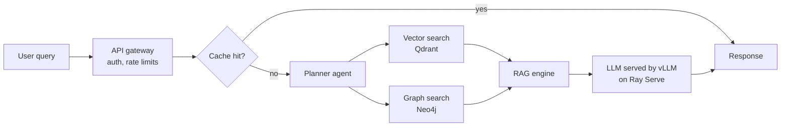
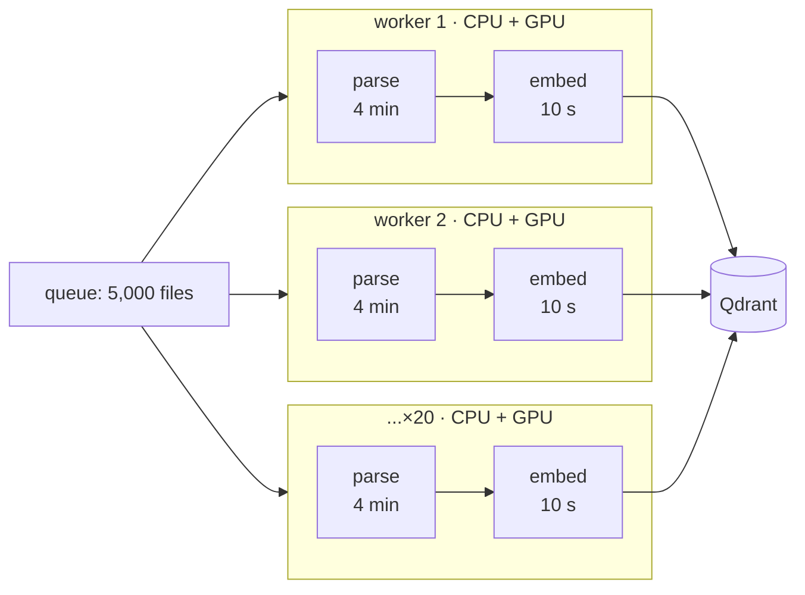
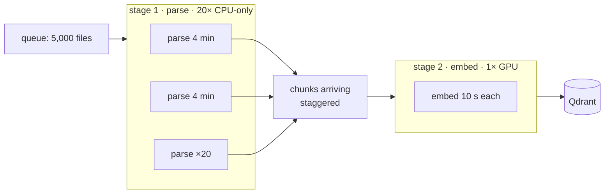
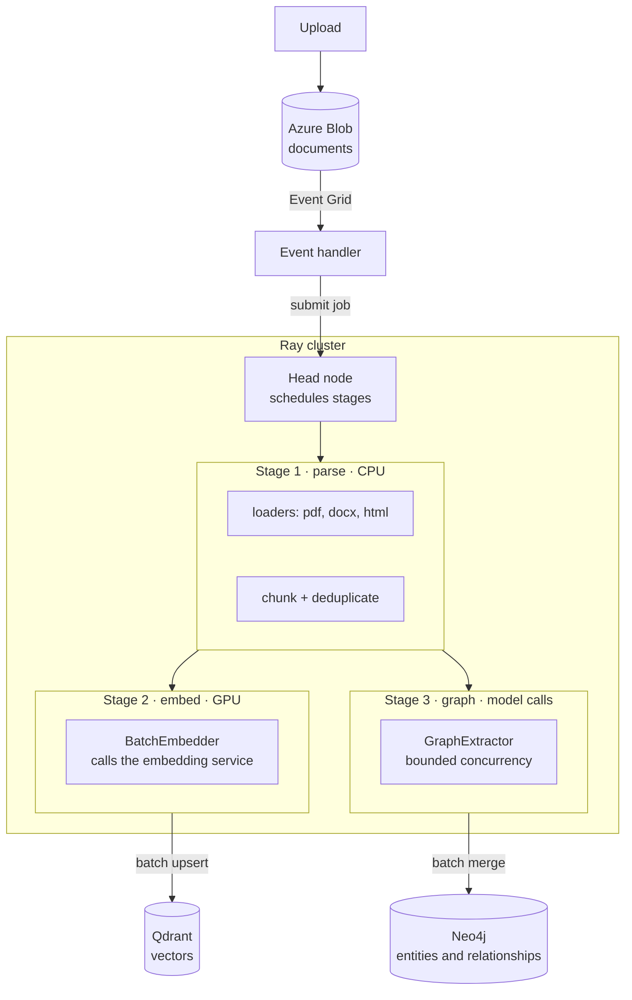

# Architecture

A retrieval-augmented generation (RAG) system over an internal company
database, self-hosted on Kubernetes. A user asks a question; the system
retrieves from both a vector store and a knowledge graph, and answers with a
self-hosted model.

Two properties drive every choice below: **retrieval is hybrid** (vector plus
graph, not either alone), and **nothing is a managed AI service** — models,
vector store and graph all run on cluster nodes the project owns.

## Request path



The planner decides which retrievers to call; the RAG engine assembles what
comes back into a grounded answer.

## Ingestion path

Separate from the request path, and asynchronous. Documents arrive from S3 or
a relational database and are turned into two indexes at once:

```
loaders → chunking → embedding → indexing → Qdrant
                   ↘ graph extraction        → Neo4j
```

The same chunk therefore appears in both stores: as a vector for similarity
search, and as entities and relationships for structural queries. Keeping the
two in step is the main correctness risk in this design.

### Why ingestion is staged rather than replicated

Ingestion cannot run inside the API: parsing thousands of files takes longer
than any request, and while it ran the service could answer nobody else. So
the API records the job and returns, and the work happens elsewhere — the same
shape as an asynchronous request-reply endpoint.

That much a queue and a worker already solve. The reason for a staged pipeline
is what the stages cost. Parsing is CPU-bound and slow; embedding is GPU-bound
and fast. Scaling the job as N identical workers forces every machine to own
both, so every machine needs a GPU.

**Replicated: one worker owns a file end to end.**



Twenty GPUs, each working ten seconds in every two hundred and fifty.

**Staged: one machine does one kind of work, and the file moves between them.**



Twenty parsers produce two hundred seconds of embedding work every two hundred
and forty, so a single GPU keeps pace. The difference is only where the
boundary sits: around a file, or around a stage.

Two properties follow. Each stage is sized to its own throughput rather than
to the slowest neighbour. And because the stages form a directed acyclic graph
— steps flowing one way, never looping back — dependencies are known in
advance, so embedding starts on the first chunks while later files are still
being parsed. Only the opening minutes are idle.

This is also one of the cases where Ray earns its place: coordination across
machines for a single job, which is a different problem from routing requests
to replicas.

### Ingestion end to end



Embedding and graph extraction are separate stages rather than one worker.
They are bound by different resources — a GPU held locally against a bounded
number of outbound model calls — so pairing them would tie the scale of each
to the other, which is the coupling this whole design exists to avoid. Both
read the same parsed chunks, and neither waits on the other.

## Components, mapped to the tree

| Directory | Holds | Notes |
|---|---|---|
| `services/gateway/` | API gateway | Auth, rate limiting, routing. The only public surface. |
| `services/api/app/routes/` | HTTP endpoints | |
| `services/api/app/agents/` + `agents/nodes/` | Planner agent and its steps | The planner chooses retrievers; nodes are the individual steps. |
| `services/api/app/tools/` | What the agent may call | Retrieval, and anything else exposed to the model. |
| `services/api/app/clients/` | Outbound clients | Qdrant, Neo4j, the model server. |
| `services/api/app/cache/` | Response and semantic cache | Sits in front of retrieval; the first thing a query meets after auth. |
| `services/api/app/memory/` | Conversation state | Per-session history. |
| `services/api/app/enhancers/` | Query rewriting, expansion | Applied before retrieval. |
| `pipelines/ingestion/loaders/` | Source readers | S3, relational sources, file formats. |
| `pipelines/ingestion/chunking/` | Splitting documents | |
| `pipelines/ingestion/embedding/` | Chunk → vector | |
| `pipelines/ingestion/graph/` | Entity and relationship extraction | Feeds Neo4j. |
| `pipelines/ingestion/indexing/` | Writing to both stores | Where the two indexes must be kept consistent. |
| `models/llm/` | Answer model, served by vLLM | |
| `models/embeddings/` | Embedding model | Must match between ingestion and query time, or retrieval silently degrades. |
| `models/rerankers/` | Reranking retrieved chunks | Present in the tree, absent from the diagram — see open decisions. |
| `libs/schemas/` | Shared contracts | The types every service agrees on. |
| `libs/observability/` | Logging, tracing, metrics | Prometheus and Grafana are the targets. |
| `libs/retry/` | Backoff and retry policy | Shared, so behaviour is uniform across clients. |
| `deploy/helm/qdrant/`, `deploy/helm/neo4j/` | Helm charts for the stores | |
| `deploy/ray/` | Ray Serve, which hosts the models | Handles batching and scaling of inference. |
| `deploy/ingress/` | Cluster ingress | |
| `infra/terraform/` | AWS infrastructure | |
| `infra/karpenter/` | Node autoscaling | Provisions GPU and CPU nodes on demand — the cost lever in this design. |

## Runtime shape

- **Kubernetes**, with services talking over a private network; only the
  gateway is reachable from outside.
- **Karpenter** provisions nodes as workloads demand them, so GPU nodes are
  not paid for while idle. Whether inference scales to zero is the single
  biggest factor in what this costs to run.
- **Ray Serve** fronts vLLM, batching concurrent requests onto the GPUs.
- **Prometheus and Grafana** for metrics; tracing and evaluation reports sit
  alongside them under monitoring.

## Decisions the diagram leaves open

These are not yet made, and each changes the build materially.

1. **When does the graph get queried?** Always, or only when the planner
   judges the question relational? Always is simpler and slower.
2. **How are the two indexes kept consistent?** A document reindexed in
   Qdrant but not in Neo4j produces answers grounded in stale structure, with
   no error anywhere.
3. **Is there a reranker?** The tree has a directory; the diagram has no box.
   A reranker improves precision at the cost of a second model in the path.
4. **Does inference scale to zero?** If yes, cold starts enter the request
   path and the API needs an asynchronous route. If no, the GPU bill is
   constant.
5. **What is evaluated, and against what?** "Model evaluation and reports"
   names the box but not the metric or the labelled set behind it.
6. **Which model, chosen how?** Self-hosting is only justified if a measured
   comparison says the self-hosted model wins on the metric that matters.

## Not in this diagram

No input or output guardrails, no PII redaction, no human review path, and no
authorisation model beyond "auth and security" as a label. For an internal
company database these are likely to be requirements rather than extras.
